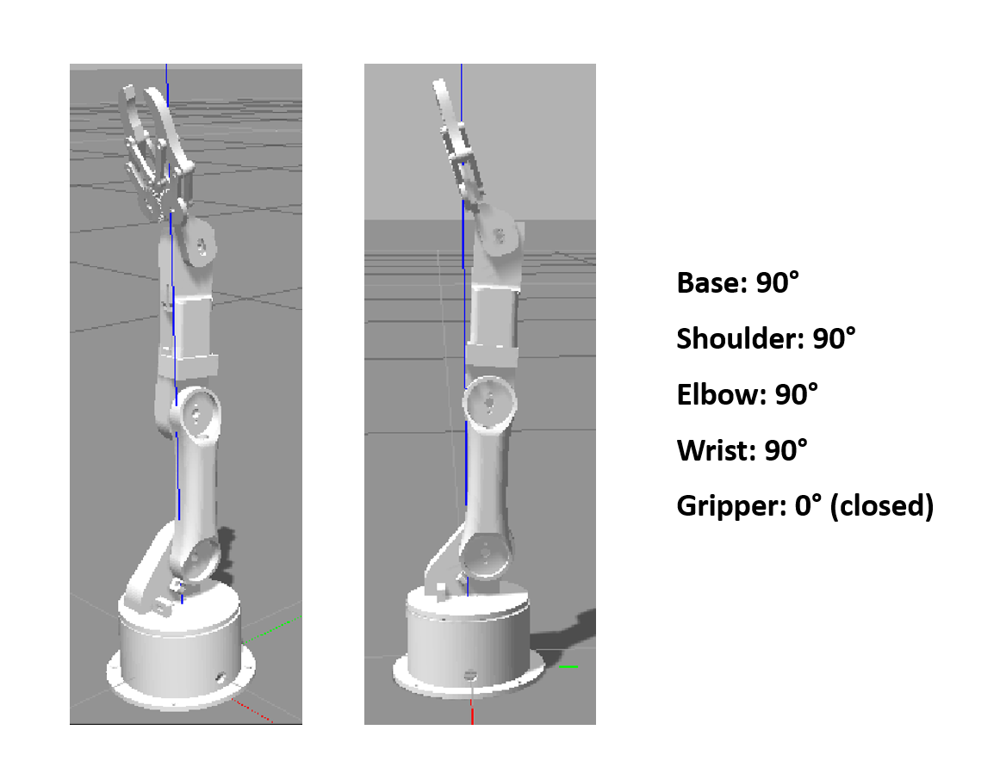

# Grouping-the-Robot-Arm-Parts
Grouping the robot arm parts using TINKERCAD, and set the arm to its initial position. This robot arm contains 5 parts; Base, Waist, two Arms, and Gripper.

## Creation Process:
  1. Download the robot arm parts from: https://github.com/smart-methods/arduino_robot_arm.git (arduino_robot_arm/robot_arm_pkg/meshes/stl/).
  2. Open a new design on TINKERCAD.
  3. Start importing the parts following the following order: Base.stl -> Waist.stl -> Arm 01 -> Arm 02 -> Gripper.stl.
  4. The used measurements were as the original stl files stated but with a Scalling value=50 for (Base.stl, Waist.stl, Arm 01, Arm 02), and a Scalling value=200 for (Gripper.stl).
  5. Organize the arm's parts as the following picture:
  
  6. Group the parts using Ctrl+G shortcut in TINKERCAD.
